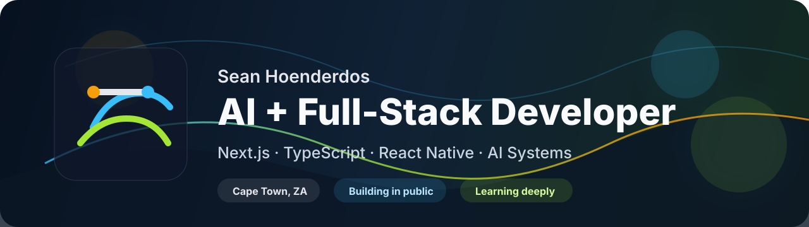

  

<h1 align="center">Hi, I'm Sean Hoenderdos</h1>

  AI + full-stack developer based in Cape Town, building practical web and mobile products with modern JavaScript tools.

  
  
  

## About

I like turning ambitious ideas into usable products: AI tools, full-stack web apps, mobile experiences, and polished frontend interfaces. Right now I am focused on sharpening my engineering fundamentals while building projects that are practical, clean, and shipped.

## Currently

- Building AI and full-stack apps with Next.js, TypeScript, and React Native.
- Exploring harnesses for AI models, including evaluation, reliability, and repeatable testing workflows.
- Turning learning projects into more polished, production-minded products.

## Tech Stack

  
  
  
  
  
  
  
  
  
  
  
  

## Featured Projects

| Project | What it shows | Stack |
| --- | --- | --- |
| [lighted](https://github.com/seanhoenderdos/lighted) | AI-powered full-stack product work with auth, Prisma, and modern Next.js architecture. | Next.js, TypeScript, Prisma, AI |
| [ai-teaching-saas](https://github.com/seanhoenderdos/ai-teaching-saas) | SaaS-style AI learning product with auth, voice AI, observability, and a full-stack app structure. | Next.js, TypeScript, Clerk, Supabase, Vapi |
| [banking](https://github.com/seanhoenderdos/banking) | Modern banking platform concept with financial integrations and a polished product direction. | Next.js, TypeScript, Plaid, Dwolla, Appwrite |
| [ai-resume-analyzer](https://github.com/seanhoenderdos/ai-resume-analyzer) | Practical AI tool for analyzing resumes and working with document-heavy user flows. | React Router, JavaScript, PDF tooling |
| [macOs-portfolio](https://github.com/seanhoenderdos/macOs-portfolio) | Interactive, visual portfolio work with motion and a desktop-inspired interface. | React, Vite, GSAP, Zustand |
| [fooddelivery](https://github.com/seanhoenderdos/fooddelivery) | Mobile app product flow with navigation, native UI patterns, and Expo-based development. | React Native, Expo, TypeScript |

## GitHub Snapshot

  
  

## Contact

I am always open to talking about AI products, full-stack apps, creative frontend work, and practical ways to make software more useful.

- Email: [sean.hoenderdos@gmail.com](mailto:sean.hoenderdos@gmail.com)
- LinkedIn: [sean-hoenderdos-ux-engineer](https://www.linkedin.com/in/sean-hoenderdos-ux-engineer/)
- GitHub: [@seanhoenderdos](https://github.com/seanhoenderdos)
