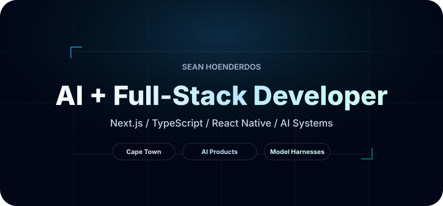

  

<h1 align="center">Hi, I'm Sean Hoenderdos</h1>

  Frontend developer + UX designer based in Cape Town. 
  I turn ideas and problems into thoughtful digital experiences — from the first concept to the shipped product.

  <a href="mailto:sean.hoenderdos@gmail.com">Email</a>
  &nbsp;·&nbsp;
  <a href="https://www.linkedin.com/in/sean-hoenderdos-ux-engineer/">LinkedIn</a>
  &nbsp;·&nbsp;
  <a href="https://github.com/seanhoenderdos">GitHub</a>

 

## A little about how I build

I work somewhere between design and development.

My UX background means I rarely see frontend work as just implementing a screen. I think about the problem behind it, the structure, how someone moves through it, how it responds, and the details that make an experience feel considered.

**Then I build it.**

That often means moving between product thinking, interface design, React, motion, APIs and whatever else the idea needs to become something real.

 

## What I'm exploring right now

- Building more expressive frontend experiences with **GSAP, interaction and scroll-driven motion**
- Taking ideas from **UX thinking → interface → working product**
- Going deeper with **React, Next.js and TypeScript**
- Using **AI, APIs and automation** where they genuinely improve the product
- Continuing to sharpen the engineering behind the interfaces I design

 

## I build with

  
  &nbsp;&nbsp;
  
  &nbsp;&nbsp;
  
  &nbsp;&nbsp;
  
  &nbsp;&nbsp;
  

**Frontend**  
React · Next.js · TypeScript · JavaScript · Tailwind CSS · GSAP

  
  &nbsp;&nbsp;
  
  &nbsp;&nbsp;
  
  &nbsp;&nbsp;
  
  &nbsp;&nbsp;
  

**Beyond the interface**  
Node.js · PostgreSQL · Prisma · Supabase · REST APIs · Git

 

## Selected work

### [Shearon Pharmaceuticals ↗](https://shearonpharma.co.za)

**Commercial work · UX + Frontend Development**

A production website for Shearon Pharmaceuticals combining responsive frontend development, interaction design and motion with the practical requirements of a real business.

The experience includes a product catalogue, responsive product views, enquiry and newsletter flows, legal and compliance content, video-led presentation and motion.

`Next.js` `TypeScript` `Tailwind CSS` `GSAP` `Neon` `Resend`

> Commercial project · Source code kept private.

---

### [Lighted ↗](https://lighted.life)

**Commercial work · Product Development**

I contributed to the development of Lighted, an AI-assisted workspace built around a real user workflow.

The project gave me experience working on a production product where the interface, application logic and supporting systems all had to work together as one experience.

`Next.js` `TypeScript` `PostgreSQL` `AI`

> Commercial project · Source code kept private.

---

### [macOS Portfolio ↗](https://github.com/seanhoenderdos/macOs-portfolio)

**Guided project · Independent mobile implementation**

I built the desktop experience while following a JavaScript Mastery course, then took on the challenge of designing and implementing the mobile version independently.

The mobile work required rethinking the desktop interaction model for smaller screens, touch interaction, navigation and responsive application behaviour rather than simply shrinking the desktop UI.

`React` `Vite` `GSAP` `Zustand`

> Desktop implementation guided by JavaScript Mastery · Mobile experience designed and built independently.

---

### [Food Delivery ↗](https://github.com/seanhoenderdos/fooddelivery)

**Guided foundation · Independently extended**

The initial application structure and tab navigation were built while following a JavaScript Mastery tutorial.

I then extended the application independently by building its dynamic product detail experience and search functionality, including Appwrite-backed product data, keyword search and category filtering.

`React Native` `Expo` `TypeScript` `Zustand` `Appwrite`

> Guided foundation · Product detail experience and search functionality built independently.

 

## Beyond the interface

I enjoy frontend most, but I don't treat it as an isolated layer.

I've worked with authentication, databases, APIs, AI workflows, automation and application architecture when a project required it.

For me, **the technology is there to support the experience — not the other way around.**

Some of my commercial work lives in private repositories to respect client ownership and confidentiality.

 

## Say hello

I'm interested in frontend engineering, UX, creative development and teams that care about how digital products both **work and feel**.

[Email me](mailto:sean.hoenderdos@gmail.com) · [LinkedIn](https://www.linkedin.com/in/sean-hoenderdos-ux-engineer/)
